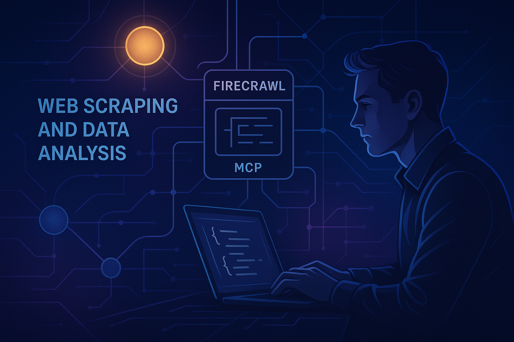

# RESEARCH USING FIRECRAWL-MCP
<p align="center">
  
</p>

This project demonstrates a simple chat application using the `MCPAgent` with built-in conversation memory, leveraging the MCP (Multi-Channel Platform) and LangChain integrations. It is designed for experimentation and learning with browser automation and LLM-powered agents.

---

## Features
- Interactive chat with memory
- Uses LangChain's Groq and Anthropic integrations
- Browser automation via MCP and Firecrawl
- Easy configuration and extension

---

## Prerequisites
- **Python 3.12+**
- **[uv](https://github.com/astral-sh/uv)** (for fast virtual environment and dependency management)
- A Windows environment (instructions use Windows PowerShell syntax)
- API keys for Groq (and optionally Anthropic)

---

## Setup Instructions

### 1. Clone the Repository
```sh
git clone <your-repo-url>
cd mcp_prac
```

### 2. Create and Activate a Virtual Environment (using uv)
```sh
uv venv
.\.venv\Scripts\activate
```

### 3. Install Dependencies
All dependencies are specified in `pyproject.toml`:
```sh
uv pip install -r requirements.txt  # or just use uv run app.py (see below)
```

### 4. Environment Variables
Create a `.env` file in the project root with your API keys:
```
GROQ_API_KEY=your_groq_api_key_here
# Optionally, for Anthropic:
# ANTHROPIC_API_KEY=your_anthropic_api_key_here
```

### 5. MCP/Firecrawl Configuration
The `browser_mcp.json` file configures the MCP server for browser automation and Firecrawl. It includes a Firecrawl API key (already set for demo purposes). If you have your own, replace it in the file:
```json
{
  "mcpServers": {
    "firecrawl-mcp": {
      "command": "npx",
      "args": ["-y", "firecrawl-mcp"],
      "env": {
        "FIRECRAWL_API_KEY": "your_firecrawl_api_key_here"
      }
    }
  }
}
```

---

## Running the Application

### Main Chat Application
Run the interactive chat using:
```sh
uv run app.py
```
- Type your messages at the prompt.
- Type `exit` or `quit` to end the conversation.
- Type `clear` to clear the conversation history.

### Example Output
```
================Interactiv MCP chat================
Type 'exit' or 'quit' to end the conversation.
Type 'clear' to clear the conversation history.
================Start================
You: hello
Assistant: Hi! How can I help you today?
```

---

## File Overview
- `app.py` — Main chat application using MCPAgent and LangChain
- `browser_mcp.json` — MCP/Firecrawl server configuration
- `pyproject.toml` — Project metadata and dependencies
- `main.py` — Minimal hello-world script (not used for main functionality)
- `uv.lock` — Lock file for reproducible installs (auto-generated)

---

## Troubleshooting
- **GROQ_API_KEY not set**: Ensure your `.env` file is present and contains your key.
- **Dependency issues**: Run `uv pip install -r requirements.txt` or ensure your venv is activated.
- **MCP/Firecrawl errors**: Check your API key and internet connection.
- **Windows path issues**: Use `\\` or `/` as needed for paths.

---

## Useful Links
- [uv documentation](https://github.com/astral-sh/uv)
- [LangChain](https://python.langchain.com/)
- [Groq API](https://console.groq.com/)
- [Anthropic API](https://console.anthropic.com/)
- [Firecrawl](https://firecrawl.dev/)
- [MCP (playwright-mcp)](https://github.com/microsoft/playwright-mcp)

---

## License
This project is for educational and demonstration purposes.
